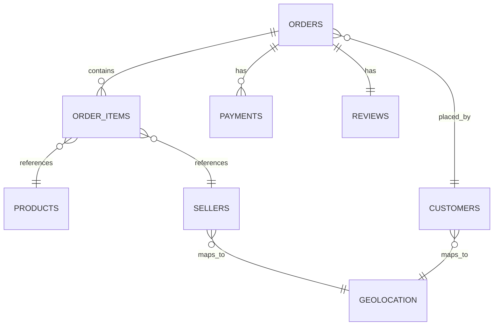

## 1. Business Requirements Document (BRD)

### 1.1 Domain Classification

Business requirements are grouped into four domains:

| Domain                           | Focus                                     | Stakeholders                |
| :------------------------------- | :---------------------------------------- | :-------------------------- |
| **Financial Performance**        | Revenue, order value, freight costs       | CEO, Finance                |
| **Logistics & Delivery**         | Delivery time, late deliveries            | Operations                  |
| **Customer Satisfaction**        | Reviews, product quality                  | Product, Customer Success   |
| **Geographic & Seller Insights** | Regional performance, seller contribution | Sales, Marketing, Expansion |

**Priority Order:**
1. Financial & Logistics – operational imperatives
2. Customer Satisfaction – leading indicator
3. Geographic & Seller – strategic growth

---

### 1.2 KPI Definitions

#### Category A – Financial Performance

| # | KPI | Definition | Source |
| :--- | :--- | :--- | :--- |
| 1 | **Total Revenue** | `SUM(price)` from delivered orders | Order Items |
| 2 | **Average Order Value** | Revenue ÷ number of unique orders | Orders + Order Items |
| 3 | **Total Freight Cost** | `SUM(freight_value)` from delivered orders | Order Items |

**Rationale:** Revenue excludes freight because freight is a cost of service, not product revenue. Canceled orders are filtered out.

---

#### Category B – Logistics & Delivery

| # | KPI | Definition | Source |
| :--- | :--- | :--- | :--- |
| 4 | **Average Delivery Time** | `AVG(DATEDIFF(day, purchase, delivery))` | Orders |
| 5 | **Late Delivery Rate** | `(Late Orders ÷ Delivered Orders) × 100` | Orders |

**Calculation Details:**
- Filter `order_status = 'delivered'`
- Late delivery = `delivered_date > estimated_date`

---

#### Category C – Customer Satisfaction

| # | KPI | Definition | Source |
| :--- | :--- | :--- | :--- |
| 6 | **Average Review Score** | `AVG(review_score)` | Reviews |
| 6b | **Review Response Rate** | `(Orders with review ÷ Delivered orders) × 100` | Reviews + Orders |
| 7 | **Top 5 Lowest Rated Categories** | Categories with lowest average review score, minimum 5 reviews | Reviews + Products + Translation |

**Note:** NULL review scores are ignored, not replaced with 0.

---

#### Category D – Geographic & Seller Insights

| # | KPI | Definition | Source |
| :--- | :--- | :--- | :--- |
| 8 | **Top 3 States by Revenue** | States with highest `SUM(price)` | Items + Orders + Customers + Geolocation |
| 9 | **Top 5 Sellers by Revenue** | Sellers with highest `SUM(price)` | Items + Orders + Sellers |

---

## 2. Data Requirements Document (DRD)

### 2.1 Document Purpose

This document translates business KPIs into technical specifications: source tables, columns, transformation logic, validation rules, and target schema.

---

### 2.2 Grain Definition

**Fact Table:** `FactOrders`

**Grain:** One row per `order_id` + `product_id` combination (order line item).

**Rationale:**
- Supports all 9 KPIs
- Enables product- and seller-level analysis
- Aggregates up to order level easily
- Losing granularity is irreversible

---

### 2.3 Source Files

| # | File | Description |
| :--- | :--- | :--- |
| 1 | `olist_orders_dataset` | Core transactional log |
| 2 | `olist_order_items_dataset` | Products per order |
| 3 | `olist_order_payments_dataset` | Payment installments |
| 4 | `olist_order_reviews_dataset` | Customer feedback |
| 5 | `olist_customers_dataset` | Customer static data |
| 6 | `olist_sellers_dataset` | Seller static data |
| 7 | `olist_products_dataset` | Product catalog |
| 8 | `olist_geolocation_dataset` | Zip code to city/state lookup |
| 9 | `product_category_name_translation` | Category translation PT → EN |

---

### 2.4 Entity Relationships

**Key Relationships:**

| Relationship | Cardinality | Notes |
| :--- | :--- | :--- |
| Orders → Order Items | One-to-Many | One order, multiple products |
| Orders → Payments | One-to-Many | One order, multiple installments |
| Orders → Reviews | One-to-One | One order, one review |
| Customers → Orders | One-to-Many | Use `customer_unique_id`, not `customer_id` |
| Sellers → Order Items | One-to-Many | One seller fulfills multiple items |
| Geolocation | Lookup Table | Maps zip codes to city/state |

---

## 3. KPI Technical Specifications

### 3.1 KPI 1 – Total Revenue

| Property | Value |
| :--- | :--- |
| **Source Tables** | `olist_order_items_dataset`, `olist_orders_dataset` |
| **Columns** | `price`, `order_status` |
| **Filter** | `order_status NOT IN ('canceled', 'unavailable')` |
| **Calculation** | `SUM(price)` |

---

### 3.2 KPI 2 – Average Order Value

| Property | Value |
| :--- | :--- |
| **Source Tables** | `olist_order_items_dataset`, `olist_orders_dataset` |
| **Columns** | `price`, `order_id` |
| **Filter** | Exclude canceled orders |
| **Calculation** | `SUM(price) / COUNT(DISTINCT order_id)` |

---

### 3.3 KPI 3 – Total Freight Cost

| Property | Value |
| :--- | :--- |
| **Source Tables** | `olist_order_items_dataset`, `olist_orders_dataset` |
| **Columns** | `freight_value`, `order_status` |
| **Filter** | Exclude canceled orders |
| **Calculation** | `SUM(freight_value)` |

---

### 3.4 KPI 4 – Average Delivery Time

| Property | Value |
| :--- | :--- |
| **Source Tables** | `olist_orders_dataset` |
| **Columns** | `order_purchase_timestamp`, `order_delivered_customer_date` |
| **Filter** | `order_status = 'delivered'` |
| **Calculation** | `AVG(DATEDIFF(day, purchase, delivery))` |

---

### 3.5 KPI 5 – Late Delivery Rate

| Property | Value |
| :--- | :--- |
| **Source Tables** | `olist_orders_dataset` |
| **Columns** | `delivered_date`, `estimated_date` |
| **Filter** | `order_status = 'delivered'` |
| **Calculation** | `(COUNT(delivered > estimated) / COUNT(*)) × 100` |

---

### 3.6 KPI 6 – Average Review Score

| Property | Value |
| :--- | :--- |
| **Source Tables** | `olist_order_reviews_dataset` |
| **Columns** | `review_score` |
| **Filter** | Delivered orders only |
| **Calculation** | `AVG(review_score)` – ignores NULLs |

---

### 3.7 KPI 6b – Review Response Rate

| Property | Value |
| :--- | :--- |
| **Source Tables** | `olist_order_reviews_dataset`, `olist_orders_dataset` |
| **Columns** | `review_score`, `order_status` |
| **Filter** | Delivered orders only |
| **Calculation** | `(COUNT(review_score IS NOT NULL) / COUNT(*)) × 100` |

---

### 3.8 KPI 7 – Top 5 Lowest Rated Product Categories

| Property | Value |
| :--- | :--- |
| **Source Tables** | Reviews, Order Items, Products, Category Translation |
| **Columns** | `review_score`, `product_category_name_english` |
| **Filter** | Delivered orders only. Min 5 reviews per category. |
| **Calculation** | Group by category, `AVG(review_score)`, sort ascending, take top 5 |

---

### 3.9 KPI 8 – Top 3 States by Revenue

| Property | Value |
| :--- | :--- |
| **Source Tables** | Order Items, Orders, Customers, Geolocation |
| **Columns** | `price`, `geolocation_state` |
| **Filter** | Exclude canceled orders |
| **Calculation** | Group by state, `SUM(price)`, sort descending, take top 3 |

---

### 3.10 KPI 9 – Top 5 Sellers by Revenue

| Property | Value |
| :--- | :--- |
| **Source Tables** | `olist_order_items_dataset`, `olist_orders_dataset` |
| **Columns** | `seller_id`, `price`, `order_status` |
| **Filter** | Exclude canceled orders |
| **Calculation** | Group by seller, `SUM(price)`, sort descending, take top 5 |

---

## 4. Validation Rules

| Rule | Description | Action |
| :--- | :--- | :--- |
| **Revenue Consistency** | `SUM(price)` from Items must equal `SUM(payment_value)` from Payments per order (±0.01) | Flag order |
| **Date Order** | Delivery date must be after purchase date | Set delivery date to NULL |
| **NULL Reviews** | `review_score` kept as NULL | Create `has_review` flag |
| **Sample Size** | Categories with <5 reviews excluded from KPI 7 | Exclude from ranking |

---

## 5. Target Schema

### 5.1 Dimension Tables

| Table | Primary Key | Business Key | Attributes |
| :--- | :--- | :--- | :--- |
| `DimCustomer` | `customer_key` | `customer_unique_id` | city, state |
| `DimProduct` | `product_key` | `product_id` | category (PT/EN), weight, dimensions |
| `DimSeller` | `seller_key` | `seller_id` | city, state |
| `DimDate` | `date_key` | N/A | year, month, quarter, day of week |

### 5.2 Fact Table

**Table:** `FactOrders`

**Grain:** One row per order item.

| Column | Type | Source |
| :--- | :--- | :--- |
| `order_item_key` | Surrogate PK | Identity |
| `order_id` | Business Key | Orders |
| `customer_key` | FK | DimCustomer |
| `product_key` | FK | DimProduct |
| `seller_key` | FK | DimSeller |
| `order_date_key` | FK | DimDate |
| `delivery_date_key` | FK | DimDate |
| `price` | DECIMAL | Order Items |
| `freight_value` | DECIMAL | Order Items |
| `review_score` | DECIMAL (nullable) | Reviews |
| `has_review` | BIT | Calculated |
| `delivery_time_days` | INT (nullable) | Calculated |
| `is_late_delivery` | BIT | Calculated |

### 5.3 Surrogate Keys

| Benefit | Explanation |
| :--- | :--- |
| **Performance** | Integer joins are faster than string joins |
| **Stability** | Changes in source IDs do not affect the warehouse |

---

## 6. Assumptions

| Assumption | Description |
| :--- | :--- |
| **Data Completeness** | CSV files contain all orders from 2016–2018 |
| **Order Status** | `delivered` is the definitive indicator of receipt |
| **Timezone** | All timestamps are in Brazilian time |
| **Null Handling** | Missing prices → reject row; missing categories → fill with 'unknown' |

---

## 7. Technologies Used

| Tool | Purpose |
| :--- | :--- |
| SQL Server | Data Warehouse storage |
| SSMS | Database management |
| SSIS | ETL pipelines |
| SSAS | Semantic layer |
| Power BI | Dashboard |

---

